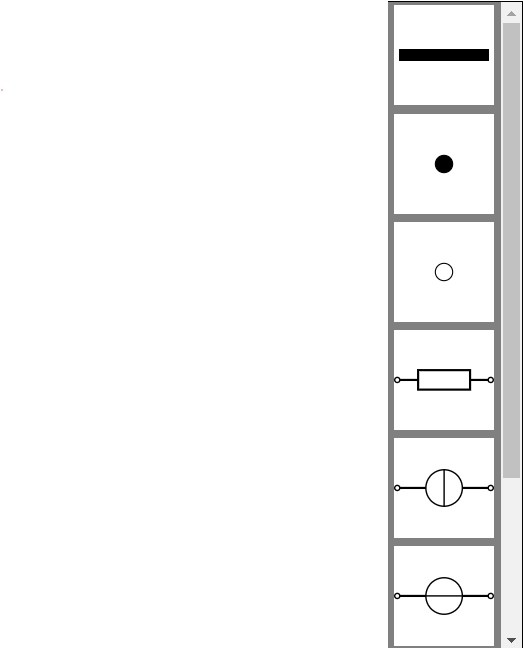
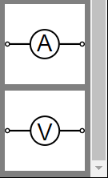
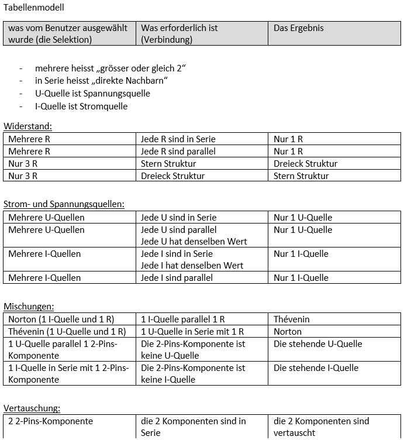
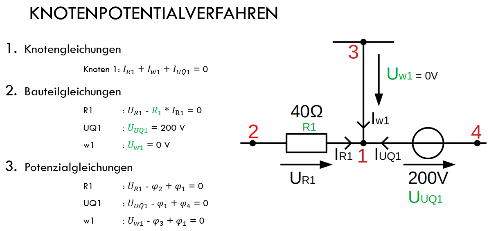
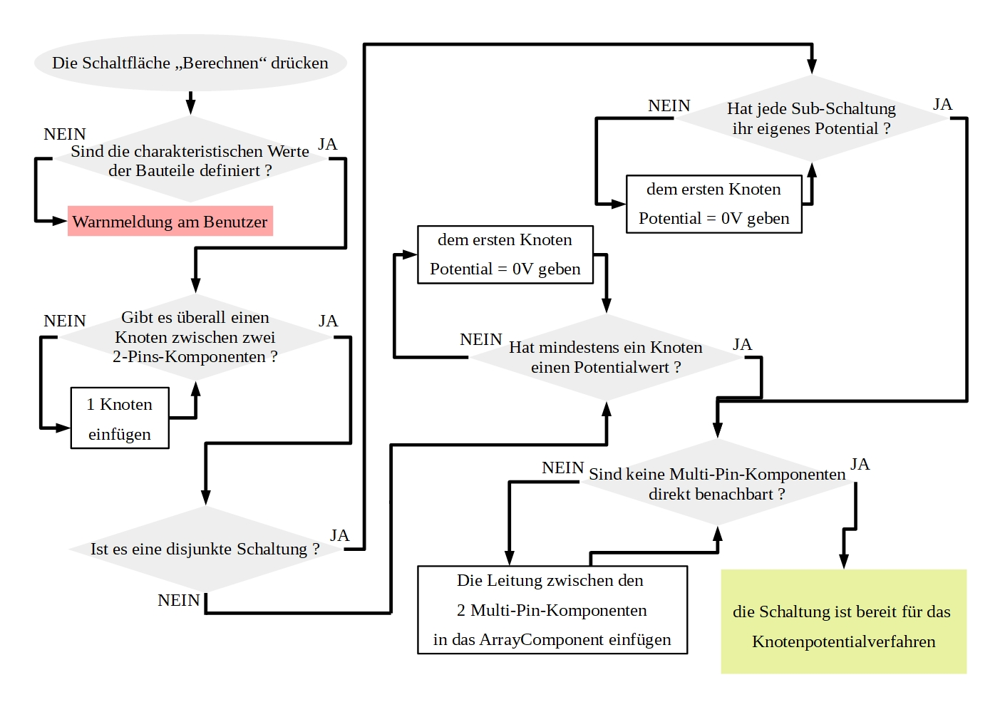

# Simulation tool for electronic circuits

### THIS VERSION IS OUTDATED

Current Version : https://gitlab.fhnw.ch/eit/simulationstool

#### _(Simulationstool Für Elektronische Schaltungen)_

Want to run this app locally ? check the file helpDevFolder/GitHubOrderCloneCommit.txt

## Table of Contents

- [Creation of a circuit](#creation-of-a-circuit)
- [Administration of the circuit](#administration-of-the-circuit)
- [Fill in values](#fill-in-values)
- [Converting components](#converting-components)
- [Solve the circuit](#solve-the-circuit)
- [Calculate equivalent sources](#calculate-equivalent-sources)
- [Advanced solving, how does it work](#advanced-solving-how-does-it-work)

---

Available online as a GitHub Page: https://desousar.github.io/sfes/

This web-application allows to solve electronic circuits.
Currently only Direct Current (DC) circuits are supported.

### Creation of a circuit

You have the electronic components present in DC (same order as on the picture):

- of course Wires to link these components
- Nodes
- Terminal
- Resistor
- Current source
- Voltage source
- Ammeter and voltmeter

You will then just have to click on the component, hold the click and release it at the desired place in the working area (area on the right).
For the Wires, the system is a little different: click on the Wire (the background color turns green), then click on the first pin, hold the mouse click and release the click over the other pin.

### Administration of the circuit

At any time you can delete, rotate, move or select one or more components. These interactions are symbolized by icons above the working area.
The rightmost icon (the mouse) allows you to deactivate any interaction, which would have been activated.

### Fill in values

All values are entered in the base unit (no prefix to the unit)

By double-clicking on the components, a pop-up window appears and allows to fill in the characteristic value of all components.
Other options will also be available, such as the ability to display the direction of the current and voltage and to change their direction.

### Converting components

Once the values are filled in, you have the possibility to select components (selection button: the mouse with a square), right click and click on the desired conversion.
Among the most known conversions, there is Norton<->Thevenin and to pass from the same type of components totally in series or totally parallel to a single component.
Otherwise here is a table of all the implemented/under implementation conversions:

### Solve the circuit

You can now press the 'Solve' button.
In case of error, please follow the instructions.

### Calculate equivalent sources

If you have placed 2 Terminals in your circuit, then you can click on 'Equivalent source' and select in which direction the equivalent sources should be calculated.
This web-application has been implemented in such a way to find the ideal current and voltage sources.

### Advanced solving, how does it work

To solve these electronic circuits, I implemented the Nodal analysis (Knotenpotentialverfahren).
Without going into too much detail, I divided this analysis into 3 phases of equation recovery:

1. there are the node equations (Knotengleichungen). These are used to record all the currents entering and leaving the nodes.
2. then there are the component equations (Bauteilgleichungen). In this phase, each equation of the components is noted. For a component like the resistor, it is the URI equation. For a current or voltage source, only the characteristic value is noted. And for a line, if it is considered a component, only its voltage is noted.
3. then, as for the component equations, consider the same components and find the potential difference to obtain the potential equations (Potenzialgleichungen).

All these equations are then assembled to form a matrix of the form A\*x=b.
By solving this matrix, all unknown values are solved.

BUT before being able to execute the Nodal analysis, it is necessary to control the circuit to know if it does not have errors, which would prevent the execution of the Nodal analysis.
To make this control readable, a diagram has been made:

